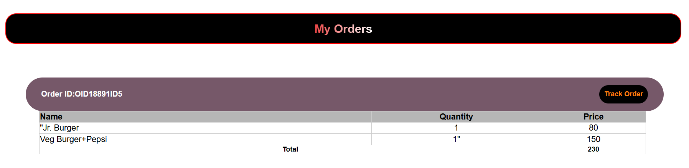

# Your-Foodie 🍽️
**Your-Foodie** is a complete food delivery web application built with PHP and MySQL. It provides a seamless user experience, from browsing the menu and placing an order to making secure payments and tracking the delivery in real-time.

## 🖼️ Project Images
### 🏠 Landing Page & Navigation


### 🔑 Secure User Authentication


### 🔑 Home Page
 

### 💳 Secure Payment Gateway


### 📋 Order History & Tracking


### 🚚 Real-Time Order Status


---
## ✨ Features

* **User Authentication**: Secure login and registration system for users.
* **Dynamic Menu**: Browse food items by categories like cakes, burgers, pizzas, and beverages.
* **Shopping Cart**: Easily add and manage items in the cart before checkout.
* **Secure Payments**: Integrated with **Razorpay** for safe and reliable online transactions.
* **Order History**: Users can view their past orders and their status.
* **Real-Time Order Tracking**: A visual tracker shows the order status from "Confirmed" to "Arrived".
* **Responsive Design**: A user-friendly interface that works on both desktop and mobile devices.
---
## 🛠️ Tech Stack

* **Frontend**: HTML, CSS, JavaScript
* **Backend**: PHP
* **Database**: MySQL
* **Payment Gateway**: Razorpay

---

## 🚀 Getting Started

To set up **Your-Foodie** locally, follow these steps:

1.  **Clone the repository:**
    ```bash
    git clone [https://github.com/Hitesh-Bhor28/Your-Foodie.git](https://github.com/Hitesh-Bhor28/Your-Foodie.git)
    ```
2.  **Navigate to the project directory:**
    ```bash
    cd Your-Foodie
    ```
3.  **Database Setup:**
    * Import the `database.sql` file into your MySQL database (e.g., using phpMyAdmin).
4.  **Configuration:**
    * Configure your database connection settings in the appropriate PHP configuration file (e.g., `config.php` or `db_connect.php`).
5.  **Run the application:**
    * Upload the project files to your web server (like XAMPP, WAMP) and access it through your browser.

---

## 📧 Contact Information

💼 Hitesh Bhor
📩 Email: [hiteshbhor28@gmail.com](mailto:hiteshbhor28@gmail.com)
🔗 GitHub: [Hitesh-Bhor28](https://github.com/Hitesh-Bhor28)
🚀 LinkedIn: [hitesh-bhor](https://www.linkedin.com/in/hitesh-bhor/)
